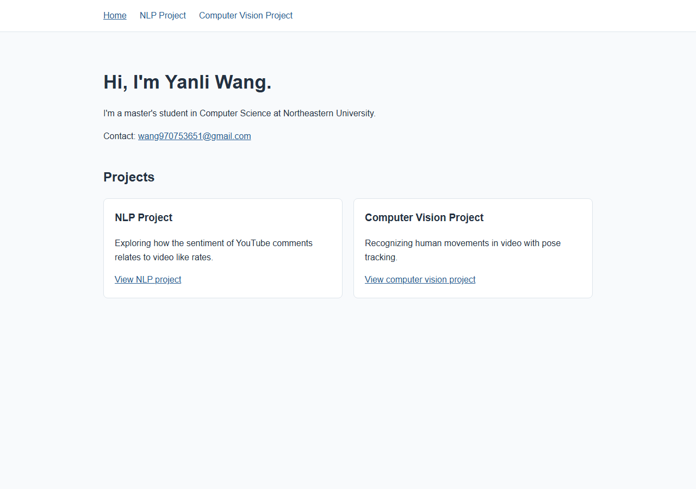

# Yanli Wang — Portfolio Project

- **Author:** Yanli Wang
- **Course:** [CS5610 Web Development, Northeastern University](https://northeastern.instructure.com/courses/261032)
- **Assignment:** [Project 1: Your personal home page](https://northeastern.instructure.com/courses/261032/assignments/3396151)

## Project objective

This portfolio introduces my background as a computer science master's student and presents two projects through short, evidence-based case studies. Visitors can move between three pages to learn what each project does, see results, and understand my contribution. The site is a static front-end project built with HTML5, CSS3, and JavaScript ES6 modules; it has no backend or component library.

## Screenshot



## Pages and features

- **[Home](index.html):** Introduction, contact email, and links to both projects. Each project card reveals an emoji-and-label popup on hover or keyboard focus; the popups stay visible on touch devices.
- **[NLP project](nlp.html):** YouTube comment sentiment study, my contribution, model comparison, results, and a link to the [project repository](https://github.com/ZheyuDeng/nlp-project). Hovering over, focusing, or clicking a model option changes the result figure and explanation.
- **[Computer vision project](vision.html):** MediaPipe pose-tracking and squat-analysis case study. A slider lets visitors inspect the down time, up time, total time, and consistency of each of six recorded squat repetitions. This is the third, AI-assisted page.

The charts and measurements come from the projects' final reports and saved outputs. The squat explorer uses values from the CS5330 project's squat-analysis CSV outputs; it does not run live pose estimation.

## Run locally

No build step is required. From the project folder, start a static server:

```powershell
python -m http.server 8000
```

Open <http://127.0.0.1:8000/index.html>. The three pages also work as static files on a hosting service such as GitHub Pages.

To install the development tools and run the formatting and lint checks:

```powershell
npm ci
npm run format:check
npm run lint
```

`npm run format` applies Prettier formatting if you edit the source. `package.json` lists the development dependencies; the website itself has no runtime npm dependencies. HTML can be checked with the [W3C HTML Checker](https://validator.w3.org/nu/). The three pages had zero errors and zero warnings in the local-file check on September 26, 2026.

## Design documents

- [Project description](01_Project_Description.pdf)
- [User personas and user stories](02_User_Personas_and_User_Stories.pdf)
- [Design mockups](03_Design_Mockups.pdf)

## Generative AI use

I used **OpenAI Codex, based on the GPT-6 sol model **, to help draft the design documents, revised and debugged the portfolio's HTML/CSS/JavaScript. 